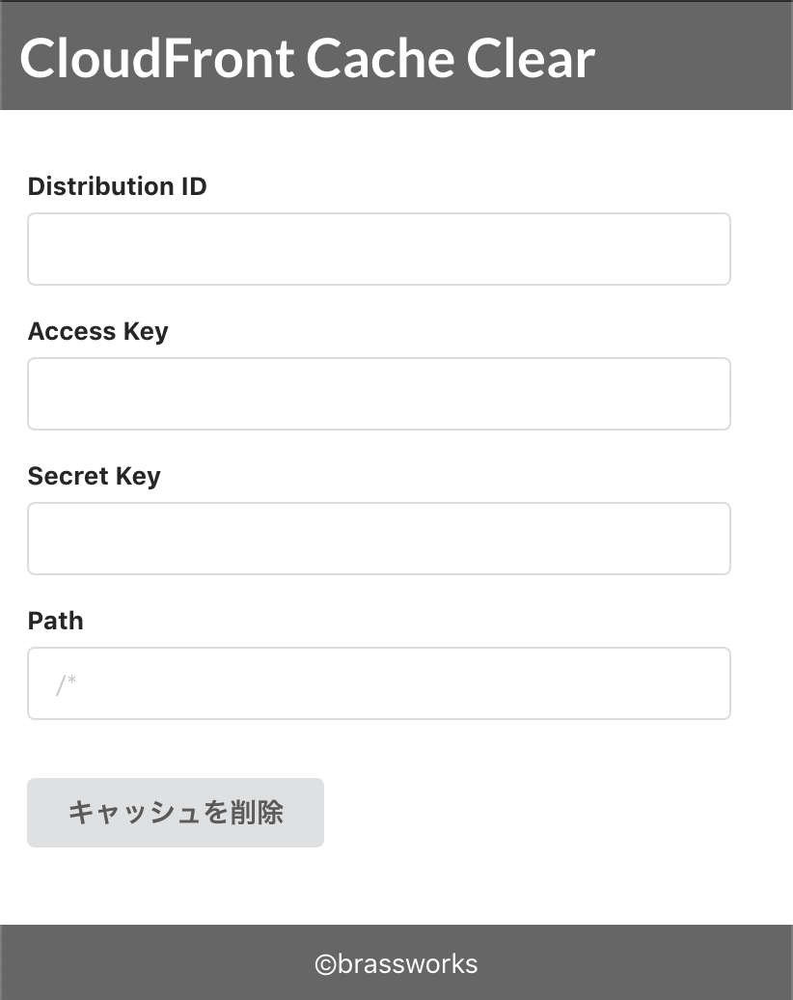

## なにか
CloudFrontのキャッシュ削除をフォームから行うウェブアプリ。

## なぜ作ったか
コンテンツ制作者がサーバーにコンテンツをアップした際にCloudFrontのキャッシュを即時削除したいというニーズに応えるため。

## 使い方
### ディストリビューションIDの準備
AWSコンソールのCloudFrontのDistributionsから対象のディストリビューションIDをメモする。

### アクセスキーとシークレットキーの準備
IAMでCloudFrontに対してInvalidationを作成する権限を持つユーザーを作成し、そのアクセスキーとシークレットキーを用いる。

以下は参考までにビジュアルエディタで作成したポリシー。2019年4月現在リソースは制限できないので「"*"」となっている

    {
        "Version": "2012-10-17",
        "Statement": [
            {
                "Sid": "VisualEditor0",
                "Effect": "Allow",
                "Action": [
                    "cloudfront:GetInvalidation",
                    "cloudfront:CreateInvalidation"
                ],
                "Resource": "*"
            }
        ]
    }

### 配置
yarn buildしてbuildディレクトリ以下を適当な場所にアップロード。

## 仕様
### 画面構成
* Invalidation実行フォーム（一画面のみ）

### 入力項目
* ディストリビューションID
* アクセスキー
* シークレットキー
* パス

## 他のCloudFrontのキャッシュ削除方法
基本的に技術者は他の手段の方が簡単なのでこのアプリを使う必要は無い。
また可能であればコンテンツ更新時にキャッシュ削除が自動で行われるように自動化するのが吉。

### AWSコンソール
Invalidationsのタブからポチポチと。

### AWS CLI
https://docs.aws.amazon.com/cli/latest/reference/cloudfront/create-invalidation.html
   
    aws cloudfront create-invalidation --distribution-id S11A16G5KZMEQD \
      --paths /index.html /error.html

### CloudFrontのオリジンにS3を利用している場合
S3の更新をトリガーにLambdaを発火させてキャッシュ削除をリクエストするのがスマート。

### CloudFrontのオリジンにWordPressを利用している場合
[C3 Cloudfront Cache Controller](https://wp-kyoto.net/c3-cloudfront-clear-cache)を使えばキャッシュ削除を自動化できる。

### プログラムによる自動化
繰り返しになるが可能であればコンテンツ更新時にキャッシュ削除が自動で行われるように好きな言語のAWS-SDKを利用して自動化するのが吉。特に運用が長期にわたる場合。